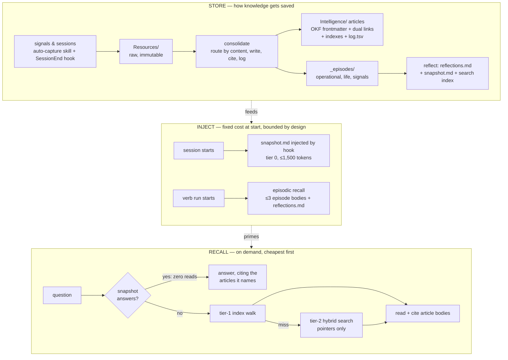
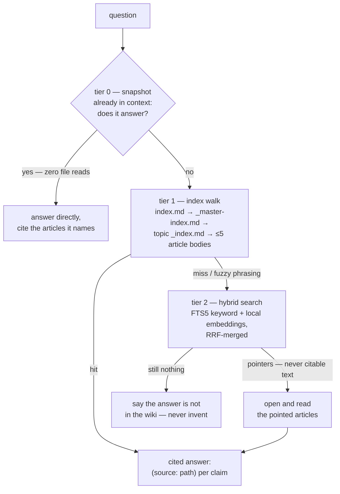
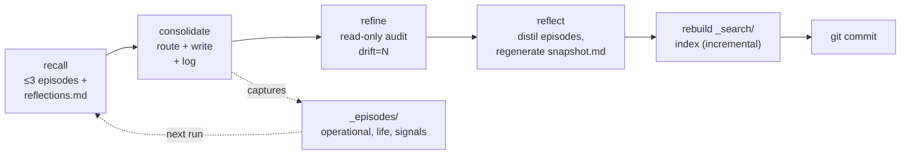
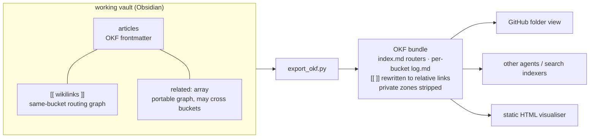

# Agentic Knowledge Engine

A wiki-backed RAG vault operated by an AI agent (Claude Code). Raw sources go in; structured, cited, interlinked knowledge articles come out. The agent handles routing, clustering, and indexing — you define the top-level taxonomy.

---

## Architecture

Two zones, two roles:

```
vault/
├── CLAUDE.md               # agent operating contract (verbs, rules, schemas)
├── schema.md               # frozen harness — read-only to the agent
│
├── Resources/              # immutable input — raw sources (clippings, transcriptions, PDFs)
│   ├── context/            # auto-capture drop folder (ephemeral signals, deleted after consolidate)
│   ├── personal/           # prescriptive sources — about-me, writing-rules (kept after consolidate)
│   └── <folder>/
│       ├── README.md       # controls consolidation and post-run deletion
│       └── *.md / *.pdf / ...
│
├── Skills/                 # agent skill definitions (read-only during vault verbs)
│   └── auto-capture/
│       └── SKILL.md        # auto-capture skill — writes signals to Resources/context/
│
└── Intelligence/           # agent-maintained wiki
    ├── index.md            # top-level bucket directory
    ├── log.tsv             # append-only run log (consolidate / refine / evaluate rows)
    ├── _unsorted/          # quarantine for sources that matched no bucket
    ├── _eval/
    │   ├── questions.md    # fixed evaluation question set
    │   └── results.tsv     # per-question results across evaluate runs
    ├── _episodes/          # episodic memory — the agent's experiences (see below)
    │   ├── _index.md       # thin router: the three kinds + tag vocabulary
    │   ├── operational/    # the agent's own verb runs
    │   ├── life/           # derived from Resources/Daily/ digests
    │   ├── signals/        # derived from Resources/context/ auto-capture drops
    │   ├── reflections.md  # distilled, merged generalized patterns
    │   └── snapshot.md     # tier-0 session-start injection (reflect-generated, ≤1,500 tokens)
    ├── _search/            # tier-2 hybrid search (FTS5 + local embeddings)
    │   ├── _index.md       # zone description
    │   ├── build_index.py  # indexer (incremental; consolidate auto-chain runs it)
    │   ├── search.py       # query CLI — returns article pointers, never answers
    │   └── index.db        # gitignored build artifact
    ├── _export/            # OKF bundle emission (the `export` verb)
    │   ├── _index.md       # zone description
    │   ├── export_okf.py   # emit a portable OKF bundle (or `--check` conformance)
    │   ├── migrate_frontmatter.py  # one-time frontmatter backfill
    │   └── okf_common.py   # shared helpers + the bucket→type map
    └── <bucket>/
        ├── _master-index.md   # bucket scope + topic list
        └── <topic>/
            ├── _index.md      # topic description + article list + related topics
            ├── article-slug.md
            └── image.png      # images live beside their article
```

At a glance, information moves through three flows — how knowledge gets
**stored**, what gets **injected** at the start of every session, and
how old knowledge is **recalled** on demand:



### Two kinds of memory

`Intelligence/` holds **semantic** memory — the buckets are facts:
cited, indexed, interlinked articles. `Intelligence/_episodes/` holds
**episodic** memory — the agent's record of *experiences* (goal →
actions → outcome → insight): its own verb runs, plus date-keyed life
episodes and captured signals. Semantic memory answers *"what is
true?"*; episodic memory answers *"what happened, and what worked last
time?"* The agent **recalls** relevant episodes into context at the
start of each run, so curation and retrieval compound instead of
restarting from scratch every time — the autoresearch loop applied to
the agent's own behaviour.

### Memory tiers — why retrieval is layered

Recall runs cheapest-first; the expensive layer only fires on a miss:

| Tier | What | Cost | When it answers |
|---|---|---|---|
| **0 — snapshot** | `_episodes/snapshot.md` injected at session start (identity + reflections + recent episodes, ≤1,500 tokens, regenerated by `reflect`) | zero reads | "what did I decide recently", identity/preference questions |
| **1 — index walk** | the `query` verb's top-down walk over curated indexes | a few routing reads + ≤5 article bodies | most questions — the primary path, carries the per-claim citation discipline |
| **2 — hybrid search** | `_search/` local SQLite index: FTS5 keyword + local-embedding semantic search, merged by reciprocal-rank fusion | one CLI call, zero API cost | fuzzy phrasing the index one-liners don't match ("that pricing thing from March") |

Tier 2 deliberately returns **pointers, not answers**: the agent opens
the pointed articles, reads them, and cites them per the schema —
search results are never themselves a citation source. The index walk
stays primary because it is curated and auditable; search is the
router of last resort that catches what word-matching misses. Storage
is mirrored on the way in: the auto-capture skill (agent-decided)
plus an optional `SessionEnd` hook (deterministic — see *Setup*) both
drop signals into `Resources/context/` for the normal `consolidate`
pipeline.

The fallback chain, end to end:



### Two layers inside `Intelligence/`

| Layer | Who creates it | Rule |
|---|---|---|
| **Buckets** (`Intelligence/<bucket>/`) | Human | Agent never invents a new bucket. Unroutable sources go to `_unsorted/`. |
| **Topics** (`Intelligence/<bucket>/<topic>/`) | Agent | Agent creates topics during `consolidate` when no existing topic fits. |

### `schema.md` — the frozen harness

`schema.md` at the vault root is the machine-readable schema contract. The agent reads it once at session start and treats it as fixed. **No verb may modify it.** It duplicates the hard rules and file schemas verbatim. If a verb run requires a schema change to succeed, that is a signal to stop and surface the question to the human — not to edit the file.

---

## The verbs

Four core verbs — `query`, `consolidate`, `refine`, `evaluate` — plus
`reflect`, which maintains episodic memory, and `export`, which emits a
portable OKF bundle on demand. **Every run is recall → act → capture:**
the agent recalls relevant past episodes before acting and writes a new
episode after, so experience accumulates across runs.

The write side runs as one auto-chain — every consolidate is audited,
distilled, and re-indexed before it is committed:



### `query`

Pull only the relevant context, top-down:

1. Read `Intelligence/index.md` — learn which buckets exist.
2. Pick the best-fit bucket(s) from one-line descriptions.
3. Read the bucket's `_master-index.md` — pick topic(s).
4. Read topic `_index.md` files — pick which article bodies to load.
5. Read only those articles. Follow `[[wiki links]]` within the same bucket only.
6. Return answer with inline citations: `(source: path/to/article.md)`.

**Budget rule:** at most 1 `index.md` + 1–2 `_master-index.md` + a handful of `_index.md` + ≤5 article bodies. Surface to the user if more is needed.

**Tier-2 fallback:** if the walk misses (or the phrasing is too fuzzy to match index one-liners), run `python3 Intelligence/_search/search.py "<query>" --json` and treat the hits as routing candidates — open, read, and cite the pointed articles normally. A search call costs 0 toward the budget; the articles it routes to count as usual.

### `consolidate`

Ingest sources from `Resources/` into `Intelligence/`:

1. Walk `Resources/` — skip folders with `include_in_consolidation: false`.
2. Route each source to the best-fit bucket(s) using `_master-index.md` Scope paragraphs.
   - No bucket fits → write to `_unsorted/`, flag in report.
   - Multiple buckets fit → write into each (images copied into each).
3. Within the bucket, pick or create a topic.
4. Write the article (schema below). Copy images into the topic folder.
5. Update `_index.md`, `_master-index.md` (if new topic), `log.tsv`.
6. Delete source if `delete_after_consolidation: true` (default).

**Per-bucket workers:** one worker per bucket — run in parallel if the runtime supports it, otherwise sequentially. Only the orchestrator writes `_unsorted/`, `index.md`, `log.tsv`, and `_eval/results.tsv`.

### `refine`

Read-only audit — report only, no writes:

- Contradictions between articles within a bucket.
- Orphan articles (no inbound wiki links from other articles).
- Concepts referenced but lacking their own article.
- Index drift (files on disk not in indexes, or vice versa).
- Cross-bucket wiki links (forbidden).
- Broken image embeds.
- Claims marked `(source: needs-verification)`.

Appends one `refine_summary` row to `log.tsv` with a **drift count** (see below).

### `evaluate`

Runs the fixed question set in `_eval/questions.md` against the live wiki. For each question the agent walks the indexes, reads articles, and self-scores:

- `files_read` — number of article bodies read to answer (the primary metric — lower is better as the wiki matures).
- `answer_quality` — `good` | `partial` | `poor` | `missing`.

Results append to `_eval/results.tsv`. The orchestrator also writes one `eval_summary` row to `log.tsv` with aggregate counts. Running `evaluate` regularly lets you track whether `consolidate` is making the wiki better at answering the questions you actually care about.

Episodic recall has its own cost line: `recall_reads` (episode bodies read during recall) is tracked **separately** from `files_read`, so the wiki-retrieval baseline stays comparable. The `eval_summary` row also trends `quarantine_rate` — together these show whether learning from experience is actually paying off (faster routing, fewer mis-routes) over time.

### `reflect`

Maintains episodic memory — reads only `_episodes/`, writes only inside it:

1. Distills recurring `Insights` across episodes into `reflections.md` — **merging and rewriting**, never appending unboundedly, so the file stays small as the store grows.
2. Stamps folded episodes `distilled: true` so they leave the hot recall surface (kept on disk for audit).
3. Appends a `reflect_summary` row to `log.tsv`.

`reflect` **auto-chains** after `consolidate` (→ `refine` → `reflect`). It never edits `CLAUDE.md` or `schema.md` — reflections feed run *context* only, never the program.

**Why recall stays cheap as episodes pile up:** a recall walk reads the `_episodes/` router, one kind-index of one-liners, then at most **3 episode bodies** plus the small merged `reflections.md`. `distilled` episodes are skipped. So recall cost is bounded — it does not grow with the store.

### `export`

Emits the wiki as a portable **OKF (Open Knowledge Format)** bundle — runs on demand, **not** part of the auto-chain. `python3 Intelligence/_export/export_okf.py [<bucket>] --out <dir>`:

- copies the (already frontmatter-bearing) articles;
- renames `_master-index.md` / `_index.md` to OKF `index.md` so GitHub and any non-Obsidian consumer read the routers natively;
- derives a per-bucket `log.md` changelog from `log.tsv` (the live `log.tsv` is never split — `log.md` exists only in the bundle);
- rewrites `[[wiki links]]` to relative markdown links **in the bundle copy** (your working vault keeps its `[[ ]]`);
- strips private zones — `_episodes/`, `_eval/`, `_search/`, `_export/`, `log.tsv`, `_unsorted/`.

`export_okf.py --check` is the no-write conformance pass `refine` reports as `okf=…`; `--tar` also emits a tarball. The result is just markdown + YAML — readable on GitHub, indexable by any tool, consumable by any agent.

---

## Schemas

### `Resources/<folder>/README.md`

```markdown
---
include_in_consolidation: true
delete_after_consolidation: true
---

# Folder name

One paragraph describing what lives here and any handling notes.
```

| Flag | Meaning |
|---|---|
| `include_in_consolidation: false` | Folder skipped entirely during consolidate |
| `delete_after_consolidation: false` | Sources consolidated but originals kept (archival value) |
| `delete_after_consolidation: true` | Sources deleted after successful consolidation (ephemeral material) |
| Missing | Defaults to `true` / `true` |

### `Intelligence/<bucket>/_master-index.md`

```markdown
# Bucket name

**Scope**: One paragraph describing what belongs here and what does not.
This is the routing signal the agent uses when allocating sources.

## Topics

- [[topic-a/_index|Topic A]] — one-line description
- [[topic-b/_index|Topic B]] — one-line description
```

### `Intelligence/<bucket>/<topic>/_index.md`

```markdown
# Topic name

One paragraph describing what this topic clusters.

## Articles

- [[article-slug|Article Title]] — one-line description

## Related Topics

- [[../other-topic/_index|Other Topic]] — one-line note
```

`Related Topics` links same-bucket topics only — never cross-bucket.

### Article

Each article opens with **OKF (Open Knowledge Format) YAML frontmatter** — the queryable interoperability surface — then the human body:

```markdown
---
type: reference              # REQUIRED — the only mandatory field (your taxonomy)
title: Article title         # matches the H1
description: one sentence — what this is and its core thesis
bucket: bucket-slug
topic: topic-slug
tags: [tag, tag]
source: Resources/path/to/source.md   # or self-authored
resource:                    # live URL of the origin, when one exists
timestamp: 2026-01-01T00:00:00Z
status: active               # active | needs-verification | deprecated
related:
  - bucket/topic/other-article.md     # repo-relative; MAY cross buckets (OKF graph)
---

# Article title

**Source:** [Source name](url-or-path)
**Author:** if known

---

## Summary

One short paragraph — what this is about and the core thesis.

## Body section

Body content. Every factual claim cites its source inline: `(source: filename.ext)`.

Embed images with `![[image.png]]` — the file must live in the same topic folder.

## Key Takeaways

- ...

## Related

- [[other-article-in-this-bucket]] · [other-article](../topic/other-article.md) — one-line note
```

`type` is the only required field (OKF prescribes no taxonomy — define your own; map buckets to defaults in `Intelligence/_export/okf_common.py`). The `**Source:**` line and inline `(source: …)` citations stay. **Dual links:** `## Related` keeps the Obsidian `[[wiki link]]` *and* a relative-path link beside it, and mirrors every edge into the `related:` array — so Obsidian and a non-Obsidian OKF consumer both traverse. See *Open Knowledge Format* below.

### Citation rules

- Every factual claim gets an inline `(source: filename)` — no bare claims.
- Two sources that disagree: note both inline, mark "Unresolved".
- No source available: mark `(source: needs-verification)` so `refine` catches it.

---

## Log and eval formats

### `Intelligence/log.tsv`

Tab-separated, 9 columns. One row per processed source for `consolidate`; one summary row per run for `refine` and `evaluate`.

```
timestamp  verb  source  bucket  topic  articles_changed  images_copied  status  notes
```

- `status` — `kept` | `quarantined` | `crashed` | `refine_summary` | `eval_summary`
- `refine_summary` rows must include `drift=<N>` in `notes`.
- `eval_summary` rows must include `total_files_read=<N>` and `quality=<Ng/Np/Npoor/Nm>` in `notes`.

### `Intelligence/_eval/results.tsv`

Tab-separated, 5 columns. One row per question per `evaluate` run.

```
timestamp  question_id  files_read  answer_quality  notes
```

- `files_read` — article bodies read (excludes index reads). The primary metric. Lower is better.
- `answer_quality` — `good` | `partial` | `poor` | `missing`.

---

## Drift count

`refine` produces a single integer — the sum of:

| Component | What it counts |
|---|---|
| Orphans | Articles with zero inbound `[[wiki links]]` from other articles in their bucket |
| Index mismatches | Entries in any index that don't resolve to a real file, or files on disk not listed |
| Broken embeds | `![[image.ext]]` references missing from the topic folder |
| Cross-bucket links | Any `[[wiki link]]` that crosses bucket boundaries. **Relative-path / `related:` links are exempt** — they are the portable OKF graph and may cross buckets; only `[[ ]]` is walled |
| Schema violations | Articles missing required sections, factual claims without citations, or a missing required `type` frontmatter key |
| Episode integrity | Episodes missing required frontmatter/sections, or any `[[ ]]` link inside an episode that points outside `_episodes/` (episodes reference articles by `(source: …)` citation only) |

The orchestrator compares the current drift count to the previous `refine_summary` row and reports **advance** (drift down, or flat with `articles_changed > 0`), **hold** (flat, no changes), or **regress** (drift up). Regressions are surfaced — never silently undone.

---

## Open Knowledge Format (OKF)

The wiki is [OKF](https://cloud.google.com/blog/products/data-analytics/how-the-open-knowledge-format-can-improve-data-sharing/)-native: a directory of markdown files, one concept per file, each carrying YAML frontmatter (`type` required, the rest optional) and cross-linked into a graph. That is exactly the shape this engine already had — so OKF here is a thin conformance + portability layer, not a different model.

**Dual-link model.** The working vault keeps Obsidian `[[wiki links]]` (same-bucket only — the curated routing graph the `query` walk follows). In parallel, every article carries a `related:` frontmatter array of repo-relative paths that **may cross buckets** — the portable, machine-readable OKF graph. The `export` verb emits a bundle in which the body `[[ ]]` are rewritten to relative links too, so a consumer with no Obsidian can traverse the whole thing. The vault is never mutated by export.



Why a format and not a service: a bundle is **just files** — readable in any editor, renderable on GitHub, indexable by any search tool, shippable as a tarball or git repo, parseable by any agent with no SDK. `type` is the only required field; you define your own type taxonomy.

---

## Hard rules

1. **`Resources/` is immutable** during a run. Only post-consolidate deletions are allowed.
2. **Wiki links are same-bucket only.** An article duplicated into two buckets is copied, not linked. This walls `[[ ]]` edges only — the parallel relative-path / `related:` channel is the portable OKF graph and may cross buckets.
3. **No silent bucket creation.** Unroutable sources go to `_unsorted/`.
4. **Topic creation is allowed and expected.** No existing topic → agent creates one.
5. **Images live beside their article.** No cross-folder image references.
6. **Indexes and log stay in sync, every run.** Stale indexes silently degrade retrieval — enforced, not advisory.
7. **File names are `lowercase-with-hyphens`.**
8. **Single locus of change.** Per-bucket workers write only inside their assigned subtree. The orchestrator is the sole writer of `index.md`, `log.tsv`, `_unsorted/`, `_eval/results.tsv`, and `_episodes/`.
9. **Schema is frozen.** No verb may modify `schema.md`.

---

## Getting started

1. Clone this repo as your vault root.
2. Replace the placeholder `domain-a` / `domain-b` buckets with your own macro taxonomy. Each bucket needs a `_master-index.md` with a Scope paragraph.
3. Replace or extend `_eval/questions.md` with questions your vault should be able to answer. These are your benchmark — be specific.
4. Fill in `Resources/personal/about-me.md` and `Resources/personal/writing-rules.md` with your own identity and style notes. These are prescriptive — the agent preserves your wording rather than paraphrasing.
5. Drop source material into `Resources/<folder>/` with a `README.md` declaring the consolidation flags.
6. Point Claude Code at the vault root and run `consolidate`.
7. Ask questions with `query`. Run `refine` periodically to catch drift. Run `evaluate` to track retrieval quality over time.

The `CLAUDE.md` and `schema.md` at the vault root are the agent's operating contract — keep them in place.

### Auto-capture

The `Skills/auto-capture/SKILL.md` skill lets the agent quietly persist conversational signals (decisions, preferences, opinions, facts) to `Resources/context/` during any conversation — no explicit "save this" needed. Those captures accumulate and are consolidated into `Intelligence/` on the next `consolidate` run, then deleted per the folder's `delete_after_consolidation: true` flag.

---

## Setup — search index and hooks

Three optional pieces upgrade the engine's memory tiers. Each works
independently; install what you need.

### Prerequisites

- `python3` (3.9+) — the search index needs nothing else for keyword mode
- `pip3 install sentence-transformers` — *optional*, enables the semantic
  tier (local model `all-MiniLM-L6-v2`, ~90 MB download on first run,
  zero API cost). Without it the index builds keyword-only and says so.
- `jq` — used by both hooks (`brew install jq`)
- Claude Code CLI on `PATH` — the capture hook calls `claude -p`

### 1. Search index (tier 2)

```bash
python3 Intelligence/_search/build_index.py        # incremental build
python3 Intelligence/_search/search.py "your query" --top 5
```

`index.db` is gitignored and rebuilt locally — never commit it. After
the first build you don't need to think about it: the `consolidate`
auto-chain reruns the indexer at the end of every run, and `refine`
reports `search_index=stale` if it ever falls behind.

### 2. SessionEnd capture hook (deterministic storage)

Guarantees every session leaves a trace: when a session ends, a cheap
model (Haiku) summarizes durable signals — decisions, preferences, new
facts — into `Resources/context/session-<timestamp>.md`, which the next
`consolidate` run routes into the wiki like any other capture. Purely
mechanical sessions produce nothing; the hook exits silently on any
error and never blocks session end.

```bash
chmod +x .claude/hooks/capture-session.sh
```

Then add the `SessionEnd` block to your vault's `.claude/settings.json`
(this repo ships a complete example — **merge** with any hooks you
already have rather than overwriting):

```json
{
  "hooks": {
    "SessionEnd": [
      {
        "hooks": [
          {
            "type": "command",
            "command": "\"$CLAUDE_PROJECT_DIR/.claude/hooks/capture-session.sh\"",
            "timeout": 120
          }
        ]
      }
    ]
  }
}
```

### 3. SessionStart snapshot hook (tier-0 injection)

Injects `Intelligence/_episodes/snapshot.md` — identity digest +
distilled reflections + recent episode one-liners, hard-capped at
~1,500 tokens — into context at every session start, so the agent
never starts from zero. The file is generated and kept within budget
by the `reflect` verb; until your first `reflect` run the hook finds
no file and injects nothing.

```json
{
  "hooks": {
    "SessionStart": [
      {
        "hooks": [
          {
            "type": "command",
            "command": "f=\"$CLAUDE_PROJECT_DIR/Intelligence/_episodes/snapshot.md\"; if [ -f \"$f\" ]; then jq -n --rawfile s \"$f\" '{hookSpecificOutput:{hookEventName:\"SessionStart\",additionalContext:$s}}'; fi"
          }
        ]
      }
    ]
  }
}
```

### Verify

```bash
# search: build, then ask something fuzzy
python3 Intelligence/_search/build_index.py
python3 Intelligence/_search/search.py "why do big groups slow down delivery"

# capture hook: start a Claude Code session in the vault, state a
# preference, exit — then check for the drop file
ls Resources/context/session-*.md

# snapshot hook: run the reflect verb once, start a new session, and
# confirm the snapshot text appears in the session context
```

---

## Design notes

- **Progressive disclosure.** The agent walks indexes top-down and reads article bodies only when needed, keeping the context window lean regardless of vault size. **Episodic recall obeys the same discipline:** a bounded tag-matched walk (≤3 episode bodies) plus a `reflections.md` that *compresses* many episodes into a few generalized lines, so recall cost stays roughly constant even as the episode store grows.
- **Two kinds of memory.** Semantic memory (buckets = facts) answers "what is true?"; episodic memory (`_episodes/` = experiences) answers "what happened, and what worked last time?" Recalling episodes at run-start lets curation and retrieval compound across runs instead of restarting cold — and `reflect` distils experience into reusable heuristics without ever touching the frozen `CLAUDE.md` / `schema.md` bedrock.
- **Human taxonomy, agent clustering.** Buckets are yours to design. Topics emerge from the material. This split keeps macro structure stable while micro-structure adapts.
- **Self-contained articles.** Images are copied into topic folders on consolidation so source deletion never breaks article embeds.
- **Per-bucket workers.** One worker per bucket — parallel where the runtime supports it, sequential otherwise — means consolidation scales with bucket count, not vault size.
- **Quarantine over guessing.** An article the agent can't route goes to `_unsorted/` and surfaces in the run report — never silently into a wrong bucket.
- **Measurable quality.** The `evaluate` verb gives the wiki a fixed benchmark. `files_read` is the primary signal: a well-structured wiki should answer questions in fewer reads as consolidation matures.
